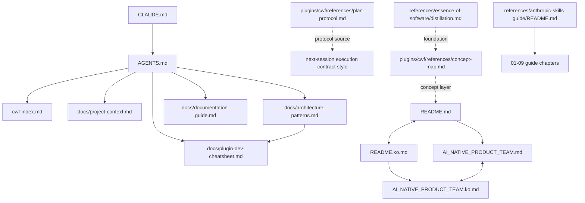

# Interactive Documentation Review Protocol

This document defines a repeatable, resumable review workflow for user-meaningful
repository documentation outside `prompt-logs/`.

## Goal

- Review documents from a user perspective, not implementation internals.
- Start with a relationship map of the documentation system.
- Continue file-by-file in small, meaningful chunks.
- For each chunk, explain intent and suggest what to pay attention to.
- Resume in the same style when only this file path is mentioned.

## Review Scope

### Include

- Root docs: [AGENTS.md](AGENTS.md), [README.md](README.md), [README.ko.md](README.ko.md), [CLAUDE.md](CLAUDE.md),
  [AI_NATIVE_PRODUCT_TEAM.md](AI_NATIVE_PRODUCT_TEAM.md), [AI_NATIVE_PRODUCT_TEAM.ko.md](AI_NATIVE_PRODUCT_TEAM.ko.md), [cwf-index.md](cwf-index.md),
  [CHANGELOG.md](CHANGELOG.md)
- Project docs: `docs/*.md`
- Plugin shared references: `plugins/cwf/references/*.md`
- Plugin internal reference docs under skills: `plugins/cwf/skills/*/references/*.md`
- External/reference docs: `references/**/*.md`

### Exclude

- Session logs and artifacts: `prompt-logs/**`
- Skill definition documents: `**/SKILL.md`
- Local runtime helper docs outside project-facing scope: `.claude/**`

## Execution Contract (Mention-Only Safe)

If the user input only mentions this file path (with or without "start"):

1. Treat it as an instruction to start or resume this interactive review workflow.
2. Do not summarize this file in one shot.
3. Execute in this fixed order:
   - Step 1: present the documentation relationship map
   - Step 2: run chunked file review from current cursor
4. Pause after every chunk and continue only with explicit user acknowledgement.
5. Update the `Review State` section in this file as progress is made.

## Queue Construction (Deterministic)

Build queue in fixed group order:

1. Anchor files (fixed order)
2. `docs/*.md` (sorted)
3. `plugins/cwf/references/*.md` (sorted)
4. `plugins/cwf/skills/*/references/*.md` (sorted)
5. `references/**/*.md` (sorted)

Reference command:

```bash
{
  printf '%s\n' \
    AGENTS.md \
    CLAUDE.md \
    cwf-index.md \
    README.md \
    README.ko.md \
    AI_NATIVE_PRODUCT_TEAM.md \
    AI_NATIVE_PRODUCT_TEAM.ko.md \
    CHANGELOG.md

  rg --files docs -g '*.md' | sort
  rg --files plugins/cwf/references -g '*.md' | sort
  rg --files plugins/cwf/skills -g '*/references/*.md' | sort
  rg --files references -g '*.md' | sort
} | awk '!seen[$0]++'
```

## Step 1: Relationship Map First

Before the first chunk in each review session, show this map and briefly explain
how documents connect.



### Link-Graph Notes (from `scripts/doc-graph.mjs`)

- Explicit links are sparse by design; many docs are discoverable through
  [AGENTS.md](AGENTS.md) + [cwf-index.md](cwf-index.md) rather than dense cross-linking.
- [README.md](README.md) and [README.ko.md](README.ko.md) cross-link each other and point to team vision docs.
- [docs/architecture-patterns.md](docs/architecture-patterns.md) links to [docs/plugin-dev-cheatsheet.md](docs/plugin-dev-cheatsheet.md).
- [references/anthropic-skills-guide/README.md](references/anthropic-skills-guide/README.md) is the entry point to its 9 chapters.

## Orphan Review Gates (Mandatory)

Treat orphan analysis as a first-class part of the interactive review.
Do not rely on chunk discussion alone for orphan coverage.

### Gate A: Session Baseline

At review start, run:

```bash
node scripts/doc-graph.mjs --json >/tmp/doc-graph-review.json || true
jq '.stats' /tmp/doc-graph-review.json
```

Record baseline:

- `total_docs`
- `total_links`
- `orphan_count`
- `broken_ref_count`

### Gate B: Group Boundary Recheck

After each queue group completes (anchors/docs/plugin refs/skill refs/references),
re-run stats and report delta from baseline:

- orphan count changed or unchanged
- broken refs changed or unchanged
- newly appeared orphan candidates (if any)

### Gate C: Per-File Inbound Check

At each file boundary in Step 2, show one line:

```text
Inbound links: <N> (orphan: yes/no)
```

Use graph data from `/tmp/doc-graph-review.json` (or refreshed file).

### Gate D: Final Orphan Triage

At end of the review cycle, classify every orphan into:

1. `Intentional orphan`
2. `Needs link fix`
3. `Deferred (decision pending)`

For each `Needs link fix`, propose:

- one candidate source file to add the link
- the target section heading where the link should be added
- why that placement is semantically correct

## Step 2: Chunked File Review

### Chunking Rules

- Use meaningful chunks, usually 60-120 lines.
- Do not break in the middle of:
  - a heading block
  - a table
  - a fenced code block
- Cover each file sequentially to EOF.
- At file boundary, ask for confirmation before moving to the next file.

### Output Contract Per Chunk

For each chunk, provide exactly:

1. `Chunk`: `{file}:{start_line}-{end_line}` and EOF 여부
2. `Excerpt`: the chunk text
3. `Meaning / Intent`: what this part is trying to do
4. `Review Focus (Line-Anchored)`: concrete points tied to exact lines/sections
5. `Link Syntax Check`: whether doc-path mentions use Markdown links (`[]()`)
6. `Discussion Prompt`: 1-2 concrete questions

Then pause.

### Review Focus Heuristics

- Audience fit: Is this written for real users at the right abstraction level?
- Scope clarity: Is the boundary of responsibility explicit?
- Actionability: Can a user execute steps without hidden assumptions?
- Consistency: Does it align with related docs (EN/KO pair, policy docs)?
- Staleness risk: Are tool names, commands, and counts likely outdated?
- Safety: Are risky operations guarded with clear constraints?
- Link usability: Are internal document references clickable (`[]()`), not plain code literals?
- Line-break hygiene: avoid unnecessary hard-wraps that reduce readability or diff quality.

## Resume Rules

On resume:

1. Rebuild queue with the deterministic rule above.
2. Read `Review State.cursor`.
3. Resume at `cursor.file` from `cursor.next_line`.
4. If the file changed and line numbers drift, find nearest previous heading and continue.
5. Keep previous style and pacing (chunk -> intent/focus -> pause).

## Review State (Update In Place)

```yaml
review_state:
  version: 1
  status: in_progress
  queue_policy: anchors_then_docs_then_plugin_refs_then_skill_refs_then_references
  map_presented_in_current_session: true
  graph_baseline:
    total_docs: 67
    total_links: 116
    orphan_count: 12
    broken_ref_count: 9
  group_progress:
    anchors_done: false
    docs_done: false
    plugin_refs_done: false
    skill_refs_done: false
    references_done: false
  cursor:
    file: AGENTS.md
    next_line: 1
  completed_files: []
  current_file_eof: false
  last_chunk_range: ""
  last_inbound_count: 0
  orphan_triage:
    intentional: []
    needs_link_fix: []
    deferred: []
  unresolved_discussion_points: []
  last_updated: "2026-02-13"
```

## Start Command

```text
@docs/interactive-doc-review-protocol.md 시작
```
